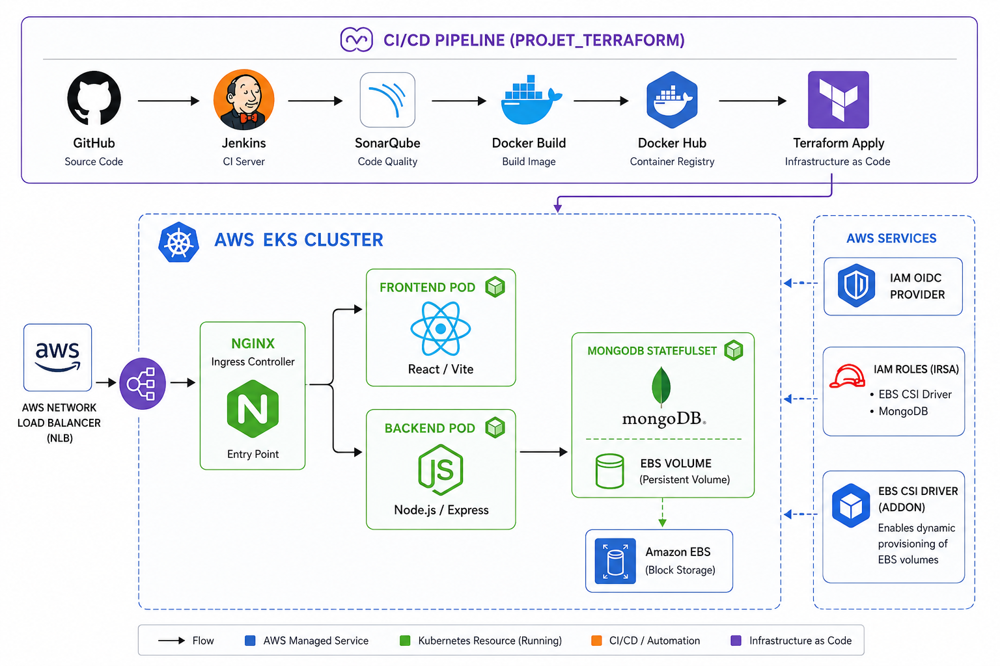

# Portfolio MERN - Infrastructure as Code

<div align="center">


**Déploiement automatisé d'une application Portfolio MERN sur AWS EKS avec Terraform et Jenkins**

</div>

---

## Table des matières

- [Vue d'ensemble](#vue-densemble)
- [Architecture](#architecture)
- [Technologies](#technologies)
- [Prérequis](#prérequis)
- [Structure du projet](#structure-du-projet)
- [Installation](#installation)
- [Déploiement](#déploiement)
- [Pipeline CI/CD](#pipeline-cicd)
- [Infrastructure Terraform](#infrastructure-terraform)
- [Accès à l'application](#accès-à-lapplication)
- [Nettoyage](#nettoyage)
- [Auteur](#auteur)

---

## Vue d'ensemble

Ce projet déploie une application **Portfolio MERN** (MongoDB, Express, React, Node.js) sur **AWS EKS** (Elastic Kubernetes Service) en utilisant **Terraform** pour l'Infrastructure as Code (IaC) et **Jenkins** pour l'automatisation CI/CD.

### Caractéristiques principales

- Infrastructure complète AWS provisionnée avec Terraform
- Cluster Kubernetes managé (EKS) avec auto-scaling
- Pipeline CI/CD automatisé avec Jenkins
- Analyse de qualité de code avec SonarQube
- Déploiement conteneurisé avec Docker
- Stockage persistant avec Amazon EBS
- Load Balancing avec NGINX Ingress Controller
- Architecture hautement disponible (Multi-AZ)

---

## Architecture



### Workflow CI/CD

1. **GitHub** : Hébergement du code source
2. **Jenkins** : Orchestration du pipeline CI/CD
3. **SonarQube** : Analyse de la qualité du code
4. **Docker Build** : Construction des images (Frontend/Backend)
5. **Docker Hub** : Registry des images conteneurisées
6. **Terraform Apply** : Déploiement de l'infrastructure AWS

### Infrastructure AWS EKS

- **NGINX Ingress Controller** : Point d'entrée unique (AWS NLB)
- **Frontend Pod** : Application React/Vite
- **Backend Pod** : API Node.js/Express
- **MongoDB StatefulSet** : Base de données avec stockage persistant (EBS)
- **IAM OIDC Provider** : Gestion des permissions IRSA
- **EBS CSI Driver** : Provisionnement dynamique des volumes

---

## Technologies

### Infrastructure & Cloud

| Technologie | Version | Description |
|------------|---------|-------------|
| **Terraform** | Latest | Infrastructure as Code |
| **AWS EKS** | 1.x | Kubernetes managé |
| **AWS VPC** | - | Réseau isolé Multi-AZ |
| **Amazon EBS** | gp2 | Stockage persistant |
| **AWS NLB** | - | Network Load Balancer |

### Application

| Composant | Technologies |
|-----------|-------------|
| **Frontend** | React 19, Vite 8, React Router, Three.js, Axios |
| **Backend** | Node.js, Express 5, Mongoose |
| **Database** | MongoDB (StatefulSet) |
| **Reverse Proxy** | NGINX |

### DevOps & CI/CD

- **Jenkins** : Automation & orchestration
- **Docker** : Conteneurisation
- **Docker Hub** : Registry d'images
- **SonarQube** : Qualité de code
- **Helm** : Gestionnaire de packages Kubernetes
- **kubectl** : CLI Kubernetes

---

## Prérequis

### Outils requis

- [Terraform](https://www.terraform.io/downloads.html) >= 1.0
- [AWS CLI](https://aws.amazon.com/cli/) >= 2.0
- [kubectl](https://kubernetes.io/docs/tasks/tools/) >= 1.28
- [Docker](https://www.docker.com/) >= 20.10
- [Helm](https://helm.sh/) >= 3.0
- [Jenkins](https://www.jenkins.io/) avec plugins : Docker, AWS, SonarQube

### Configuration AWS

```bash
# Configurer les credentials AWS
aws configure

# Vérifier l'accès
aws sts get-caller-identity
```

### Variables d'environnement Jenkins

Les credentials suivants doivent être configurés dans Jenkins :

- `dockerhub-credentials` : Username/Password DockerHub
- `aws-access-key-id` : Access Key ID AWS
- `aws-secret-access-key` : Secret Access Key AWS
- SonarQube configuré avec le nom `sonarqube`

---

## Structure du projet

```
PROJET_TERRAFORM/
├── terraform/
│   ├── main.tf              # Infrastructure AWS (VPC, EKS, IAM)
│   ├── helm.tf              # NGINX Ingress Controller
│   ├── k8s-deploy.tf        # Déploiement Kubernetes
│   ├── storage.tf           # Configuration StorageClass
│   ├── providers.tf         # Providers AWS, Kubernetes, Helm
│   ├── variables.tf         # Variables Terraform
│   └── outputs.tf           # Outputs (LoadBalancer, etc.)
├── k8s/
│   ├── configmap/           # Configuration de l'application
│   ├── secret/              # Secrets Kubernetes
│   ├── mongodb/             # StatefulSet MongoDB
│   ├── backend/             # Déploiement API
│   ├── frontend/            # Déploiement React
│   └── ingress/             # Règles d'Ingress
├── api/
│   ├── index.js             # API Express
│   ├── package.json         # Dépendances Node.js
│   └── Dockerfile           # Image Docker Backend
├── ux_react/
│   ├── src/                 # Code source React
│   ├── package.json         # Dépendances React
│   ├── nginx.conf           # Configuration NGINX
│   └── Dockerfile           # Image Docker Frontend
├── jenkinsfile              # Pipeline CI/CD
├── kind-config.yaml         # Config Kubernetes local (dev)
└── README.md                # Documentation
```

---

## Installation

### 1. Cloner le repository

```bash
git clone <repository-url>
cd PROJET_TERRAFORM
```

### 2. Initialiser Terraform

```bash
cd terraform
terraform init
```

### 3. Vérifier le plan d'exécution

```bash
terraform plan
```

---

## Déploiement

### Déploiement manuel

```bash
# Appliquer l'infrastructure Terraform
cd terraform
terraform apply -auto-approve

# Configurer kubectl
aws eks update-kubeconfig --region us-east-1 --name portfolio-cluster

# Vérifier les pods
kubectl get pods -A
kubectl get svc -n ingress-nginx
```

### Déploiement via Jenkins

1. Pousser le code sur GitHub
2. Jenkins détecte le commit automatiquement (webhook)
3. Le pipeline s'exécute automatiquement :
   - Analyse SonarQube
   - Build des images Docker
   - Push sur Docker Hub
   - Terraform Apply
   - Déploiement Kubernetes

---

## Pipeline CI/CD

### Étapes du Jenkinsfile

```groovy
1. Checkout              # Clone du repository
2. SonarQube Analysis    # Analyse qualité code (Quality Gate)
3. Build Docker Images   # Build Backend + Frontend (parallèle)
4. Push Docker Images    # Push vers Docker Hub (tag latest + build number)
5. Terraform Init        # Initialisation Terraform
6. Terraform Plan        # Planification infrastructure
7. Terraform Apply       # Déploiement AWS EKS
```

### Notifications

- Email de succès envoyé à `dsenghor96@gmail.com`
- Email d'échec avec logs en cas d'erreur
- Déconnexion automatique de Docker Hub

---

## Infrastructure Terraform

### Ressources AWS provisionnées

#### Réseau
- **VPC** : `10.0.0.0/16`
- **Subnets publics** : 2 AZ (us-east-1a, us-east-1b)
- **Internet Gateway** : Accès internet
- **Route Tables** : Routage public

#### EKS Cluster
- **Cluster EKS** : `portfolio-cluster`
- **Node Group** : 1-2 instances `t3.small`
- **IAM Roles** : Cluster + Nodes
- **OIDC Provider** : IRSA (IAM Roles for Service Accounts)

#### Stockage
- **EBS CSI Driver** : Addon EKS managé
- **StorageClass gp2** : Default
- **IAM Roles IRSA** : EBS CSI + MongoDB

#### Ingress
- **NGINX Ingress** : Helm Chart 4.10.1
- **AWS NLB** : Type LoadBalancer

### Variables Terraform personnalisables

```hcl
variable "aws_region" {
  default = "us-east-1"
}

variable "project_name" {
  default = "portfolio"
}

variable "vpc_cidr" {
  default = "10.0.0.0/16"
}

variable "instance_type" {
  default = "t3.small"
}
```

---

## Accès à l'application

### Récupérer l'URL du LoadBalancer

```bash
# Via kubectl
kubectl get svc -n ingress-nginx

# Via Terraform output
cd terraform
terraform output nginx_ingress_hostname
```

### Accéder à l'application

```
http://<LOAD_BALANCER_DNS>
```

### Vérifier les déploiements

```bash
# Status des pods
kubectl get pods

# Logs du backend
kubectl logs -l app=backend

# Logs du frontend
kubectl logs -l app=frontend

# Logs MongoDB
kubectl logs -l app=mongodb
```

---

## Nettoyage

### Détruire l'infrastructure

```bash
cd terraform
terraform destroy -auto-approve
```

### Nettoyer les ressources Docker

```bash
docker system prune -a
```

### Supprimer le cluster EKS manuellement (si nécessaire)

```bash
aws eks delete-cluster --name portfolio-cluster --region us-east-1
```

---

## Surveillance et logs

### Kubernetes Dashboard (optionnel)

```bash
kubectl apply -f https://raw.githubusercontent.com/kubernetes/dashboard/v2.7.0/aio/deploy/recommended.yaml
kubectl proxy
```

### Logs applicatifs

```bash
# Backend
kubectl logs -f deployment/backend

# Frontend
kubectl logs -f deployment/frontend

# MongoDB
kubectl logs -f statefulset/mongodb
```

---

## Dépannage

### Problème : Pods en CrashLoopBackOff

```bash
kubectl describe pod <pod-name>
kubectl logs <pod-name>
```

### Problème : EBS CSI Driver non fonctionnel

```bash
kubectl get pods -n kube-system | grep ebs
kubectl logs -n kube-system <ebs-csi-pod>
```

### Problème : Ingress non accessible

```bash
kubectl get svc -n ingress-nginx
kubectl describe svc nginx-ingress-controller -n ingress-nginx
```

---

## Sécurité

- Les secrets sont gérés via Kubernetes Secrets
- IRSA (IAM Roles for Service Accounts) pour les permissions AWS
- Les credentials AWS/DockerHub sont stockés dans Jenkins Credentials
- MongoDB utilise un volume EBS chiffré par défaut
- Le VPC utilise des Security Groups restrictifs

---

## Améliorations futures

- [ ] Ajouter un certificat SSL avec AWS Certificate Manager
- [ ] Mettre en place Prometheus + Grafana pour le monitoring
- [ ] Implémenter Horizontal Pod Autoscaler (HPA)
- [ ] Ajouter des tests unitaires et d'intégration
- [ ] Configurer AWS Backup pour MongoDB
- [ ] Implémenter GitOps avec ArgoCD ou Flux

---

## Auteur

**Dieynaba SENGHOR**

- Email : dsenghor96@gmail.com
- GitHub : [github.com/dieys](https://github.com/dsenghor96)
- Docker Hub : [hub.docker.com/u/dieys](https://hub.docker.com/u/dieys)

---

## Licence

Ce projet est sous licence MIT.

---

<div align="center">
  
**Made with :heart: using Terraform, AWS EKS, and Jenkins**

</div>
